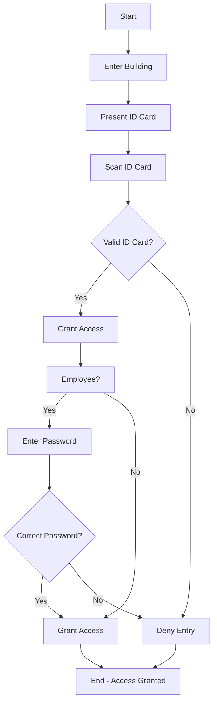

# Office_security_system

## ARM Course Project - Group 1

### Project Title: Office security system

**Group Members:**
1. Guruprasad Kamat
2. Fardin Khan
3. Shravan Hoskoti
4. Rochan Bachari

**Description:**
The project implements a password-based gate control system using ARM microcontroller LPC21xx. Users can enter the password via an external keyboard (UART). If the password is correct, the gate opens that means stepper motor rotates, and the system displays a "HELLO" message on the LCD while showing "You are welcome" on the UART display. In case of an incorrect password, the system triggers a buzzer indicating an intrusion. An external interrupt is utilized for emergency situations, enabling gate access even with an incorrect password.

**Flowchart:**
The following flowchart represents the steps involved in the Office Security System. This system is designed to control access to the building and ensure only authorized personnel can enter.

**Components:**
1. LPC21xx ARM Microcontroller
2. External Keyboard (UART)
3. LCD Display
4. Stepper Motor
5. Buzzer

**Code Structure:**
- Main Function: Initiates UART and handles password processing.
- Buzzer Function: Controls the buzzer for sound output.
- Stepper Motor Function: Manages the stepper motor rotation.
- UART Display Function: Handles UART display (monitor) messages.
- LCD Function: Initializes and displays on the LCD screen.
- Serial Function: Initializes UART communication.
- External Interrupt Function: Handles emergency situations.
- Timer Function: Initializes and manages the timer.

**Simulation and Testing:**
The simulation demonstrates the system's proper functioning, including password validation, message display, and emergency access handling. The project code has been tested on the ARM microcontroller to ensure real-world functionality.

**Note:** The code and simulation files are available in the repository. For any questions or assistance, please contact the group members or the project's mentor.
